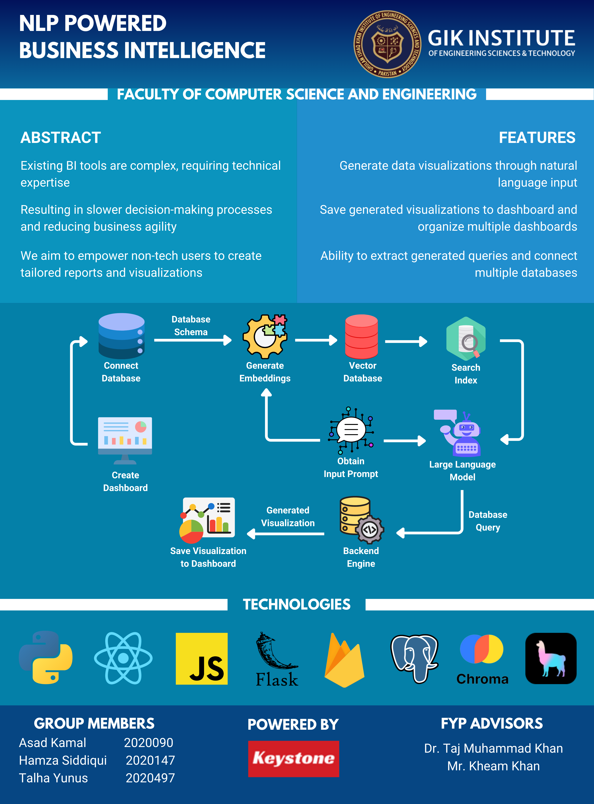

# NLP-Powered BI Application



[](frontend/)
[](api/)
[](db/)
[](api/chatbot.py)

An end-to-end Business Intelligence application that lets users query relational data in natural language, convert those requests into SQL, and transform query results into interactive dashboards and visual analytics.

This project was developed as a **Final Year Project** and is designed as a proof of concept for making BI systems more accessible to non-technical users. Instead of writing SQL manually, a user can ask questions conversationally, inspect the generated query, preview the returned data, and save charts to custom dashboards.

## Live Demo

- Frontend demo: https://nlp-bi-app.netlify.app/
- Project demo video: [NLP-Powered-BI-App_Video.mp4](docs/assets/NLP-Powered-BI-App_Video.mp4)
- Thesis document: [Thesis.pdf](Thesis.pdf)

## Demo Preview

<video src="docs/assets/NLP-Powered-BI-App_Video.mp4" controls width="100%">
  Your browser does not support the video tag.
</video>

If the embedded player does not render on your platform, open the video directly: [NLP-Powered-BI-App_Video.mp4](docs/assets/NLP-Powered-BI-App_Video.mp4)

## Why This Project Matters

Traditional BI platforms are powerful, but they often require technical expertise to model data, write SQL, or configure reports. This project explores a more accessible workflow:

- Users ask business questions in plain English.
- The system retrieves relevant schema context and generates SQL.
- Results are shown as tables and charts.
- Visualizations can be saved into reusable dashboards.

The goal is to reduce the gap between raw enterprise data and business decision-making.

## Key Features

- Natural language to SQL querying for PostgreSQL databases
- Schema-aware prompting using retrieved database metadata
- Support for multiple dashboards per user
- Chart generation from query results
- Dashboard persistence using Firebase/Firestore
- Authentication flow for individual users
- Multiple chart types including bar, line, pie, doughnut, radar, and scatter
- Pluggable model choice in the UI between GPT-based generation and Defog-based SQL generation
- Sample Northwind-style PostgreSQL dataset for proof-of-concept testing

## Architecture Overview

The system is split into four main layers:

- **Frontend (`frontend/`)**: Next.js application that handles authentication, database selection, chatbot interaction, charting, and dashboard management.
- **Backend (`api/`)**: Flask API that manages database connectivity, executes SQL, and coordinates the chatbot pipeline.
- **AI Layer**: LangChain + OpenAI + ChromaDB components used to build schema-aware prompts and generate SQL from natural language.
- **Data Layer (`db/`)**: PostgreSQL schema and sample data used to demonstrate the application end-to-end.

## Project Screens and Assets

### Entity Relationship Diagram

The repository already includes the ER diagram for the sample database used in the proof of concept:


### User Journey Supported by the App

1. Authenticate into the application
2. Connect a PostgreSQL database and specify its schema
3. Ask a business question in natural language
4. Inspect the generated SQL and returned table
5. Choose chart axes and chart type
6. Save the visualization to a dashboard for later reuse

## Tech Stack

### Frontend

- Next.js 13
- React 18
- Material UI
- Chart.js
- Recharts
- Axios
- Firebase Authentication
- Firestore

### Backend

- Python
- Flask
- Psycopg2
- SQLAlchemy
- Pandas
- LangChain
- ChromaDB
- OpenAI API

### Database

- PostgreSQL
- Northwind-style sample dataset in [`db/nlp_bi.sql`](db/nlp_bi.sql)

## Repository Structure

```text
NLP-Powered-BI/
|-- api/          Flask backend, chatbot logic, schema utilities
|-- frontend/     Next.js frontend and dashboard UI
|-- db/           Sample PostgreSQL schema, queries, ER diagram
|-- defog/        Additional Defog-related backend code
|-- Thesis.pdf    Final year project thesis/report
```

## How It Works Internally

### 1. Database onboarding

The user connects a PostgreSQL database from the frontend. The backend stores the connection for the active session and initializes the chatbot with the selected schema.

### 2. Schema extraction

The backend reads table and column metadata from `information_schema`, formats it into a schema prompt, and stores it in a ChromaDB collection for lightweight retrieval.

### 3. Natural language to SQL

When a user asks a question, the chatbot retrieves the most relevant schema fragments and sends them to the selected model. The model is instructed to return only valid SQL for the available schema.

### 4. Query execution and rendering

The generated SQL is executed against PostgreSQL. Results are returned to the UI, where the user can inspect the output, generate a chart, and save the configuration to a dashboard.

## Setup Instructions

> The current repository is a research/prototype codebase. Some configuration values are hardcoded in the source, so for a clean public deployment you should replace them with environment variables before sharing production credentials.

### Prerequisites

- Node.js and npm
- Python 3.10+
- PostgreSQL
- An OpenAI API key
- A Firebase project for authentication and Firestore

### 1. Clone the repository

```bash
git clone <your-repo-url>
cd NLP-Powered-BI
```

### 2. Import the sample PostgreSQL database

Create a PostgreSQL database and import the SQL dump from `db/nlp_bi.sql`.

```sql
CREATE DATABASE nlp_bi;
```

Then import the file using your preferred PostgreSQL workflow, for example through `psql`.

### 3. Start the backend

```bash
cd api
pip install -r requirements.txt
flask --app app run
```

The backend is expected to run on `http://localhost:5000`.

### 4. Start the frontend

```bash
cd frontend
npm install
npm run dev
```

The frontend is expected to run on `http://localhost:3000`.

### 5. Configure services

Before using the app, update the Firebase configuration and provide your own database connection details and OpenAI API key.

## Notable Implementation Details

- The chatbot keeps short conversational memory to support follow-up questions.
- SQL generation is constrained using retrieved schema context rather than the full database dump.
- Users can inspect the generated SQL before turning the result into a chart.
- Dashboard visualizations store SQL plus chart metadata so they can be reloaded later.
- The prototype focuses primarily on PostgreSQL as the proof-of-concept database.

## Research and Academic Value

This project sits at the intersection of:

- Natural language processing
- Human-computer interaction
- Business intelligence systems
- Data visualization
- Applied large language model workflows

From an academic perspective, it demonstrates how conversational interfaces can improve access to enterprise analytics for users who are not comfortable with SQL or conventional BI tooling.

## Current Limitations

- The implementation is still prototype-oriented and not yet production hardened.
- Sensitive configuration values should be migrated to environment variables.
- Error handling and security constraints around generated SQL can be improved.
- The current proof of concept is centered on PostgreSQL rather than many database engines.
- UI polish and deployment packaging can be further refined for production use.

## Future Scope

- Support additional relational and cloud data sources
- Add safer SQL validation and query guardrails
- Improve prompt engineering and schema retrieval quality
- Expand dashboard customization and report export features
- Add role-based access, auditability, and stronger deployment hygiene
- Connect external SaaS platforms through APIs for cross-system analytics

## Thesis and Documentation

For the full academic write-up, methodology, and discussion, see [Thesis.pdf](Thesis.pdf).

