# Test Results

## Query test for monthly profit

### 1. calculate the monthly profit for the year 2022

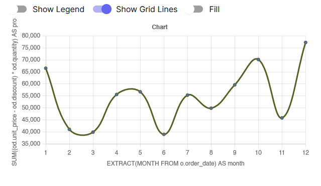

Result: Positive

### 2. show the profit for the first three months only

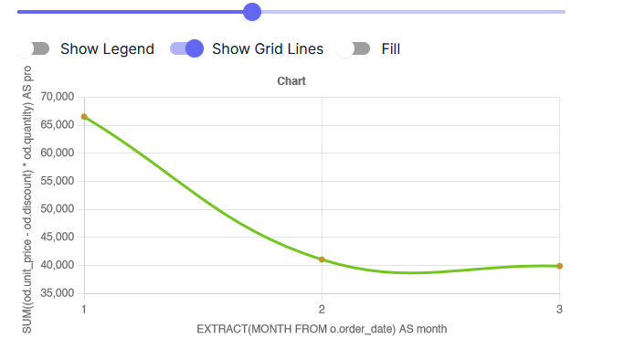

Result: Positive

### 3. show the profit for the last three months only

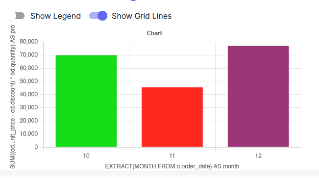

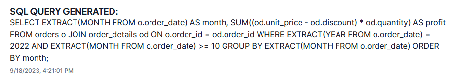

Result: Positive

### 4. show the result in ascending order

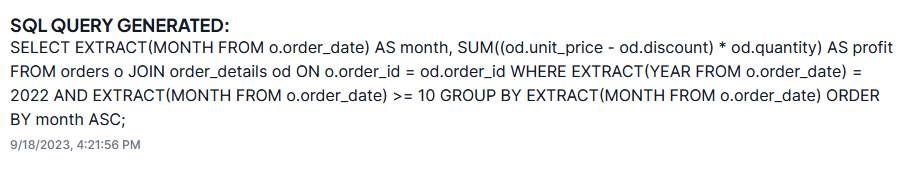

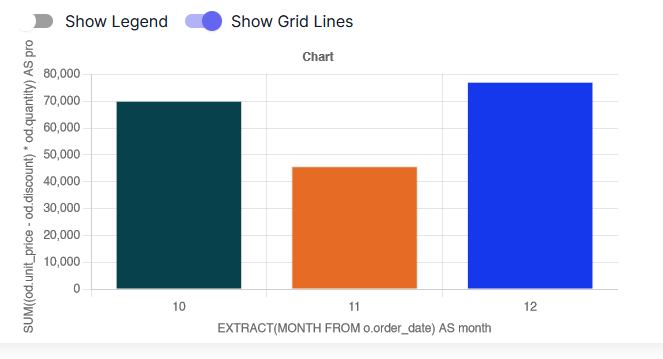

Result: Negative
Comments: months taken as ascending

### 5. show the results for the last query in ascending order

Result: Same as 4.

### 6. what is the sum

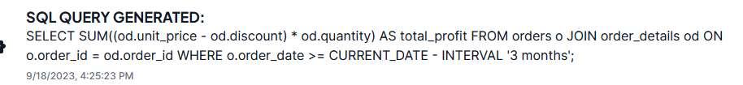

Result: Could not retrieve data
Comments: Interval taken of 3 months but from current date not the year 2022.

### 7. show the profit for the last three months of the year 2022 in ascending order

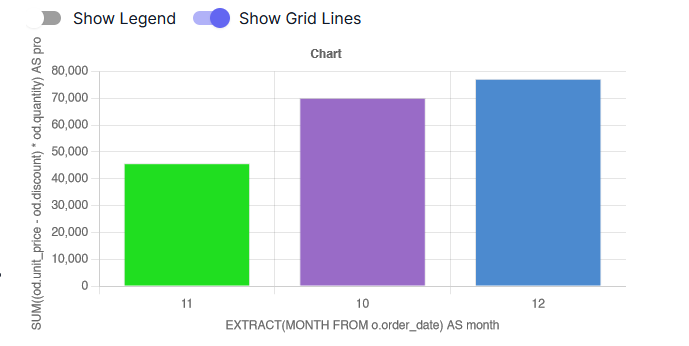

Result: Positive

### 8. show the sum of monthly profit for the last three months of the year 2022

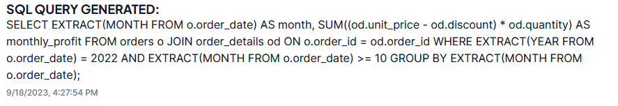

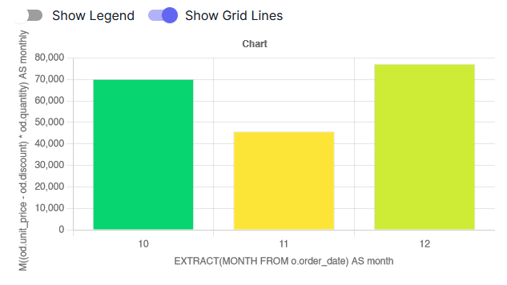

Result: Negative
Comments: It seems that Sum was only used for monthly profit calculation

### 9. show the total sum of monthly profit for the last three months of the year 2022

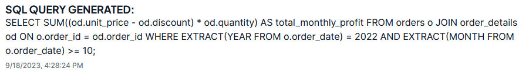

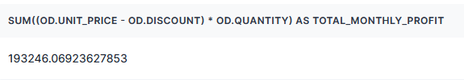

Result: Positive
Comments: Component for single value yet to be made.

## Query test for Best Categories

### 1. show the best categories according to most sales

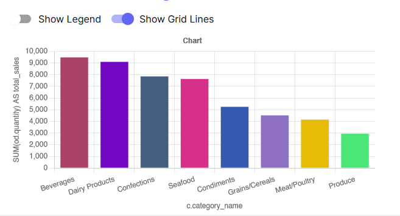

Result: Positive

### 2. show the categories below 8000 sales

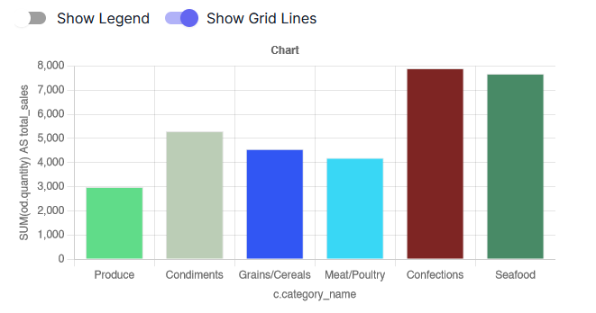

Result: Positive

### 3. show in ascending order

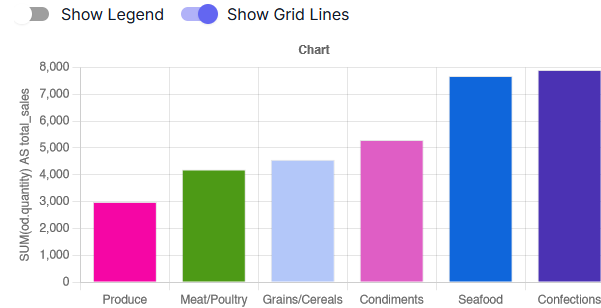

Result: Positive
Comments: Ascending order done on last query.

### 4. show in descending order

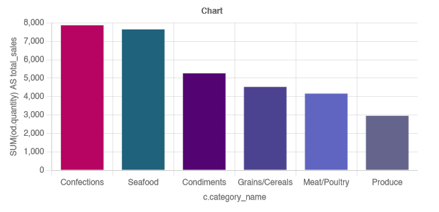

Result: Positive
Comments: Descending order done on last query.

### 4. show the top 3 from the last query

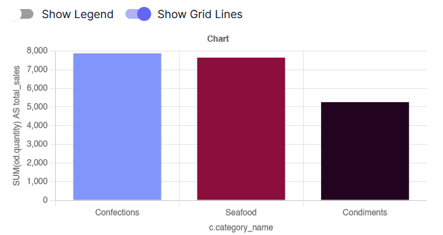

Result: Positive
Comments: action performed on last query.

### 5. show the worst category

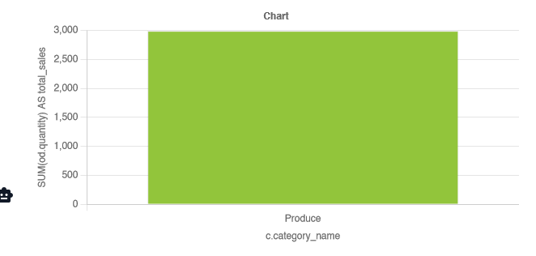

Result: Positive
Comments: worst categary taken from list of all categories.
